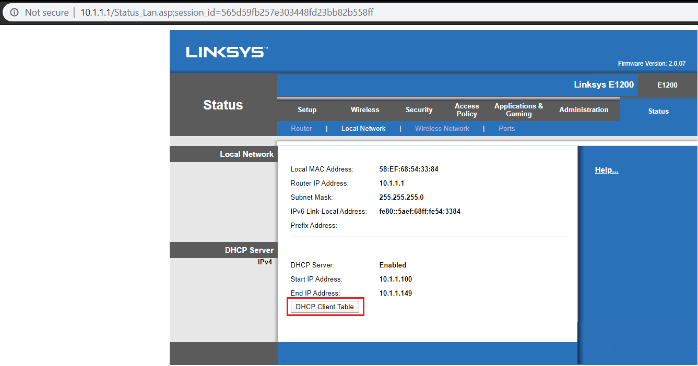

# Real-World-Federated-Learning

Exploring the use of Federated Learning on a set of Raspberry PI's. The goal is to develop a distributed recommender system that will give individual users a recommendation on movies they might like.
Using a neural collaborative filtering model on the latest Raspberry PI to date to provide the recommendations.

<h2>Raspberry Pi setup</h2>
<ul>
	<li>Installing raspbian buster lite</li>
	
With the formatted SD card we need to install the Raspbian image.
	I will be using balenaEtcher, which is available for Windows, Mac and Linux.
	<a href="https://www.balena.io/etcher/">Link</a>

	<li>Download the Raspbian Buster Lite image <a href="https://www.raspberrypi.org/downloads/raspbian/">Link</a></li>	
	<li>Use balenaEtcher to select the image and drive and then flash the image to the drive.</li>
	<li>Enable SSH on the Raspberry Pi</li>
	
Insert the SD card into your computer 
	Navigate to the boot directory on the SD card.  
	Create a file called “ssh” 
	SSH is now enabled. You can now insert the SD card back into the pi. 
	

	<li>How to connect to the pi</li>
	
Turn on the pi. 
	You will need to connect both your computer and the pi to the same router. Connect the raspberry pi to the router via the ethernet cable and connect your computer to the router via WIFI.
	Now you will need to find out what devices are on the network. I will be using Linksys’ router page. I accessed this webpage by typing in the IP address into my browser, 
	for example my router’s IP was 10.1.1.1. 
	Navigate to the status tab and click on Local Network in the sub menu. Click on DCHP table to find other devices connected to the router. 
	
	In a terminal on the connected pc type  
	<code>ssh pi@ (device ip)</code>
	For example: 
	My Raspberry Pi’s IP: 10.1.1.141 (As seen in the DCHP table) 
	<code>ssh pi@10.1.1.141</code> 
	Default Raspbian installations comes with this default account: 
	Username: pi 
	Password: raspberry 
	Now with SSH you can enable wifi(next step), removing the need to be connected to the router.  
	

	<li>Connect to WIFI</li>
	
Full set and more details for connecting to the WIFI can be found here: <a href="https://www.raspberrypi.org/documentation/configuration/wireless/wireless-cli.md">Raspberry Pi WIFI</a>
	Brief Setup 	
	<code>sudo raspi-config</code> 
	Choose network 
	Enter in your country 
	You will need to find your SSID(router name id example “Linksys05783”) and passphrase 
	Use this command again: <code>sudo raspi-config</code> to update the time for the raspberry pi.
	

	
If you cannot update teh time with the above method the use this command#
	<code>sudo date -s '30 Oct 2019 19:26'</code> 
	making sure to change the date and time to the current date and time. 
	Once done run: 
	sudo apt-get update 
	
 
	<li>Check the version of python on the raspberry pi</li>
	<code>python --version</code>
	
if the version is python3.6 then you're ready to go, if not you will need to get python version 3.6

	<li>Install pip3 on the raspberry pi <a href="https://www.raspberrypi.org/documentation/linux/software/python.md">link</href></li>
	
command: <code>sudo apt install python3-pip</code> 
	This will give us the python 3 version of pip 
	Update pip: 
	<code>pip3 install --upgrade pip</code>
	

	<li>Install tensorflow <a href="https://www.teknotut.com/en/install-tensorflow-and-keras-on-the-raspberry-pi/#Install_in_easily_way">Link</a></li>
	

	 install the following packages: 

	<code>sudo apt-get install python3-numpy</code> 
	<code>sudo apt-get install libblas-dev</code> 
	<code>sudo apt-get install liblapack-dev</code> 
	<code>sudo apt-get install python3-dev</code> 
	<code>sudo apt-get install libatlas-base-dev</code> 
	<code>sudo apt-get install gfortran</code> 
	<code>sudo apt-get install python3-setuptools</code> 
	<code>sudo apt-get install python3-scipy</code> 
	<code>sudo apt-get update</code> 
	<code>sudo apt-get install python3-h5py</code>
	 
	Run the following command: 
	<code>pip3 install tensorflow</code> 

	Test if the installation worked: 

	<code>Python3 -c 'import tensorflow as tf; print(tf.__version__)'</code>
	

	<li>Install Pytorch </li>
	
Download and put the whl file on the raspberry pi <a href="https://drive.google.com/file/d/1D3A5YSWiY-EnRWzWbzSqvj4YdY90wuXq/view">whl</a>

	Install the PyTorch dependencies: 
	<code>sudo apt install libopenblas-dev libblas-dev m4 cmake cython python3-dev python3-yaml python3-setuptools</code> 

	Once finished run the following command to install PyTorch: 
	 pip3 install torch_file_name.whl</code> 

	*make sure to change the name to the file that you downloaded and put on the raspberry pi 

	Test if the installation worked: 

	<code>Python3 -c 'import torch'</code> 
	If no errors show then the installations worked

	<li>Install PySyfy <a href="https://medium.com/secure-and-private-ai-writing-challenge/a-step-by-step-guide-to-installing-pysyft-in-raspberry-pi-d8d10c440c37">link</a></li>
	

	Download and put the whl file on the raspberry pi whl file 

	Run the following command to install Pysyft with no dependencies: 
	<code>pip3 install syft==0.1.13a1 --no-dependencies</code> 

	Run the following command to install the needed dependencies: 
	<code>sudo pip3 install Flask flask-socketio lz4 msgpack websockets zstd</code> 

	Test if the installation worked: 

	<code>Python3 -c 'import syft</code 
	If no errors show then the installations worked 
	

</ul>

<h2>Setting up the federated system</h2>

<ul>
	<li>Clone the repo <a href="https://github.com/masons40/Real-World-Federated-Learning">Link</a></li>
	<code>cd Real-World-Federated-Learning</code>

	<li>Clone the pysyft repo <a href="https://github.com/microsoft/recommenders">Link</a></li>
	<code>cd PySyft</code>
	<code>git reset --hard 1cac86d524ac7dd6b2e6972b5f70513362e83a34</code>
</ul>

